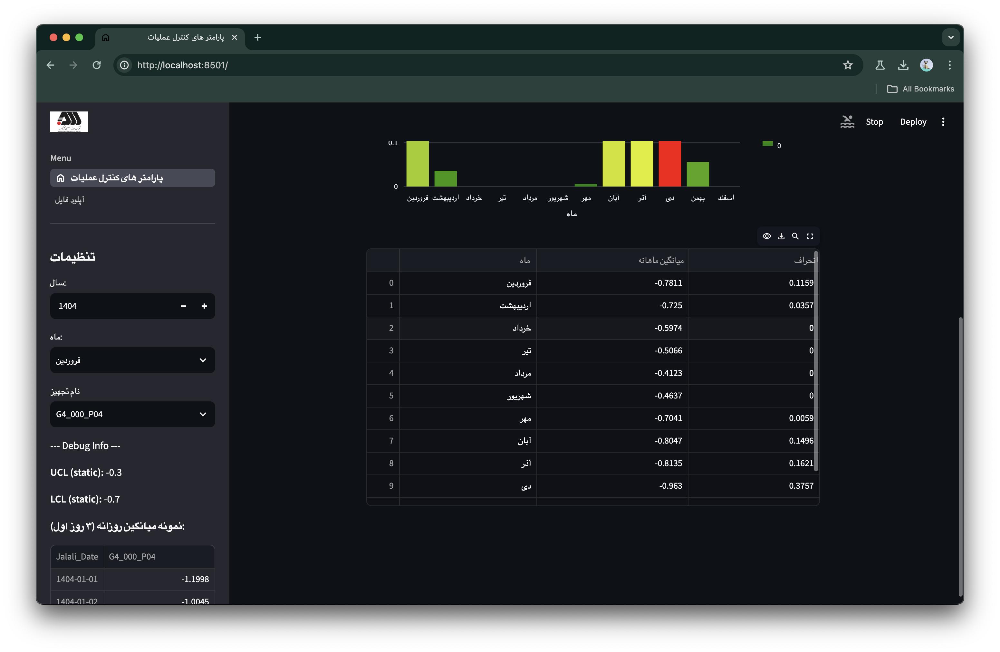
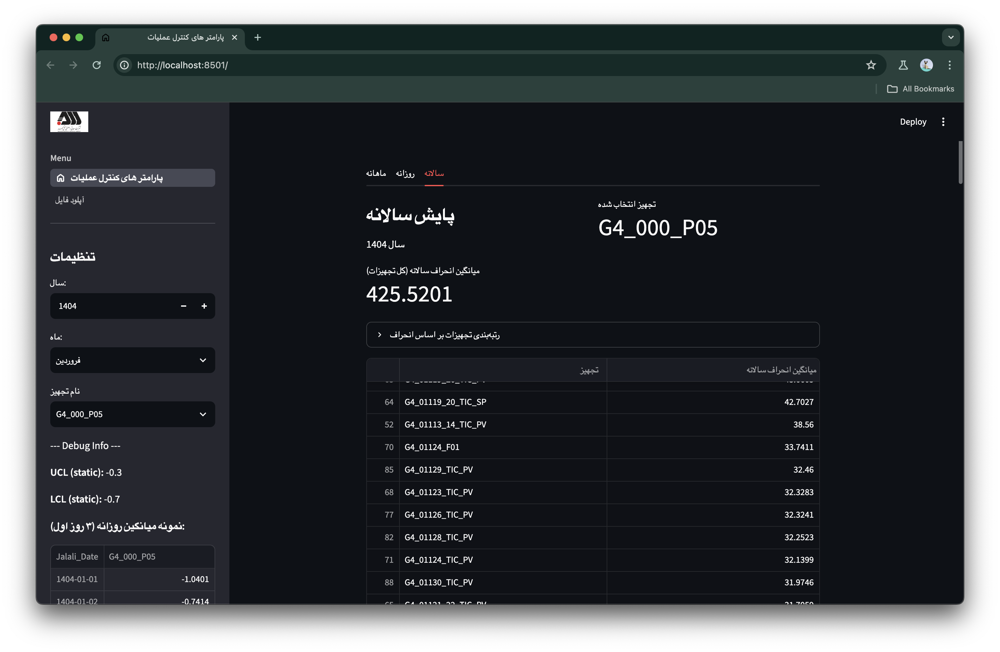
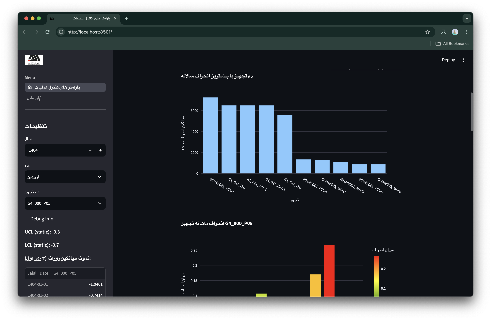
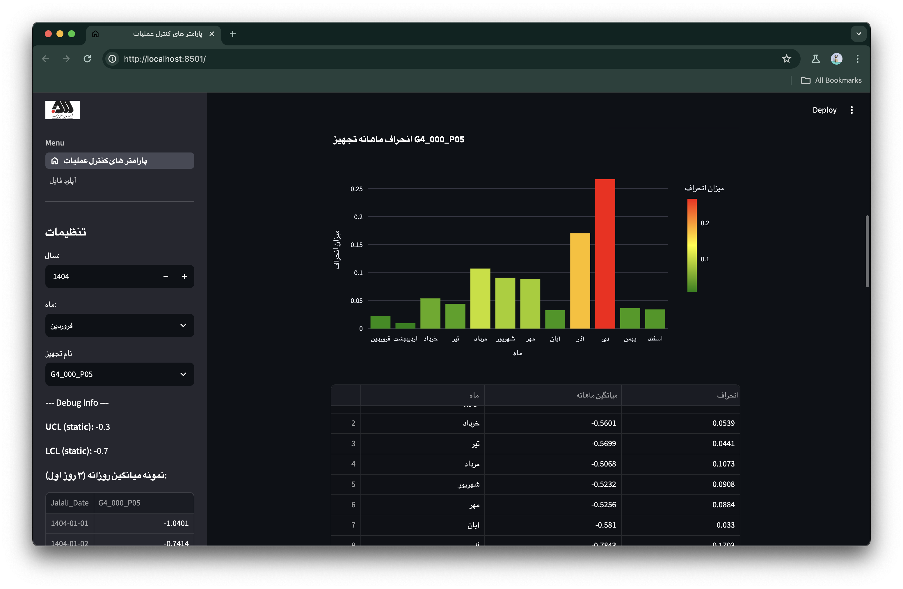
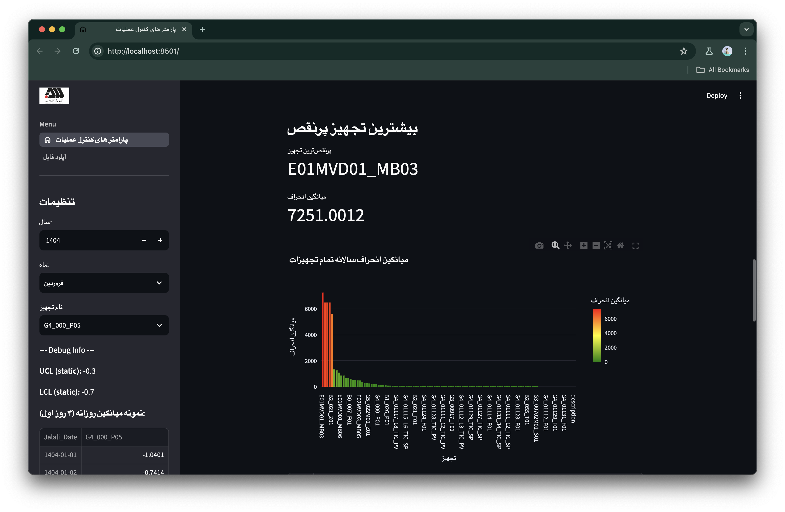
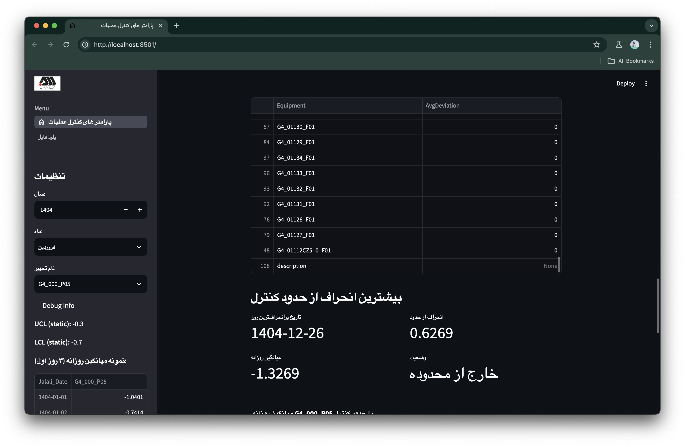
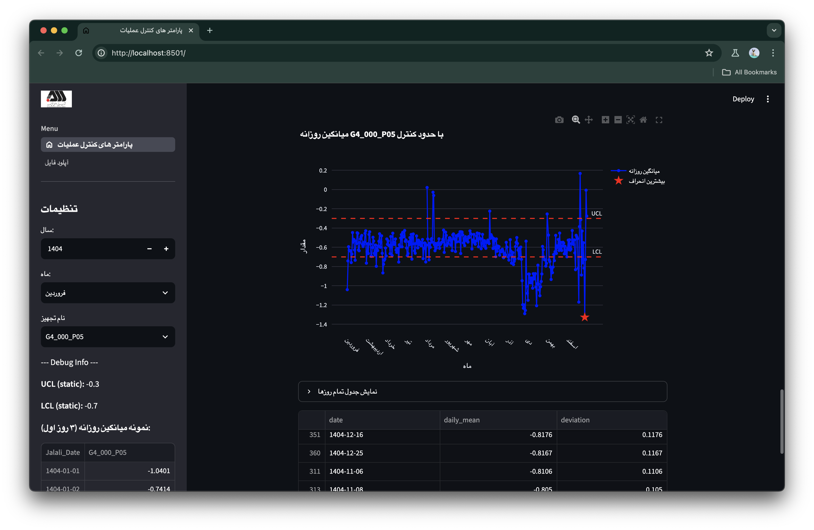

> [!WARNING]
>این پروژه برای عموم نمی باشد.

# راهنمای راه اندازی پروژه به صورت لوکال
قبل از هر کاری از نصب بودن streamlit بر روی سیستم خود به صورت گلوبال مطمئن شوید:
```sh
pip install streamlit
```

سپس برای نصب لایبرری های مورد نیاز دیگر میتوانید از دستور: 
```sh
pip install -r requirements.txt
```
استفاده کنید و اگر باز هم نتوانستید میتوانید آنها را به صورت دستی نصب کنید:
```sh
pip install streamlit jalaali jdatetime pathlib plotly numpy pandas
```

## اجرا
برای اجرای پروژه نباید از پایتون استفاده کنید و به جای آن باید از:
```sh
streamlit run app.py
```
استفاده کنید.

# اسکرینشات ها








